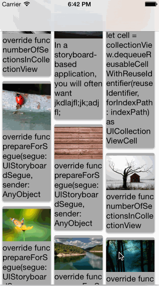

# DXWaterFlowLayout

A  waterFlowlayout imp by swift which subclass from UICollectionViewLayout waterFlow, used like the native flowLayout

###The Key

You should provide the cell's Height for a specific indexPath.item. Just provide this delegate asks.

	func collectionView(collectionView: UICollectionView, layout: DXWaterFlowLayout, heightForItemAtIndexPath indexPath: NSIndexPath) -> CGFloat
	
And Your custom collectionViewCell display depends on your imagination, here we just imp the image and text one.

So the tricky thing is calculating the cell height and layout the Cell's subviews, my example roughly did that.

###How to use

If you have played UICollectionViewFlowLayout, it may be familiar with you. In your viewController(has the collectionView)

		
    override func viewDidLoad() {
        super.viewDidLoad()

        let waterLayout = DXWaterFlowLayout()
        collectionView!.collectionViewLayout = waterLayout
        waterLayout.itemWidth = CGRectGetWidth(collectionView!.frame) * 0.3
        waterLayout.sectionInset = UIEdgeInsetsMake(10.0, 5.0, 5.0, 5.0)
        waterLayout.minumInterItemSpacing = 10.0
        waterLayout.lineSpacing = 10.0
        waterLayout.waterFlowDelegate = self
        
        collectionView!.registerClass(WaterFlowCollectionViewCell.self, forCellWithReuseIdentifier: reuseIdentifier)
        
    }
 
 Imp the delegate
 
     func collectionView(collectionView: UICollectionView, layout: DXWaterFlowLayout, heightForItemAtIndexPath indexPath: NSIndexPath) -> CGFloat {
		let photo = photos[indexPath.item]
        let result = WaterFlowCellSuggestHeight(photo.display, photo.photoDes, cellWidth)
        return result
    }
        
        
Other things just the normal way does.

###To be improved

+ Support mutli section.
+ Open an issue if you need something.
